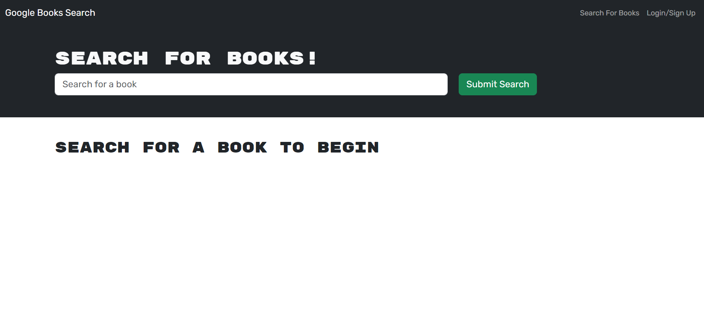
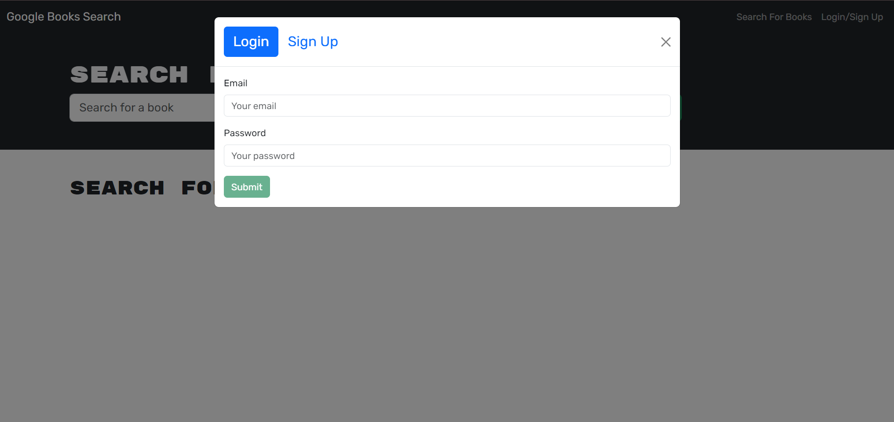
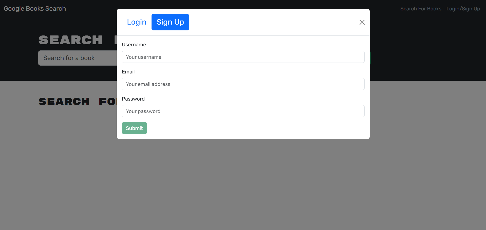
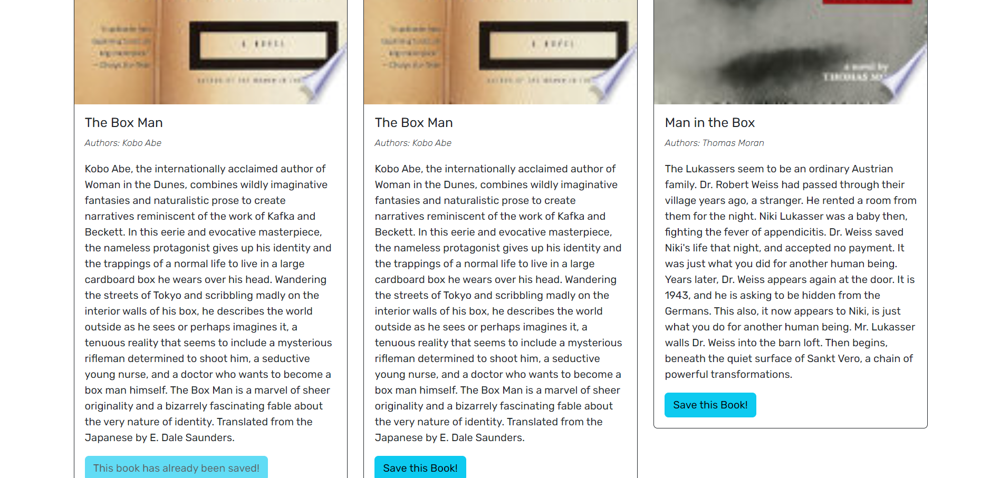
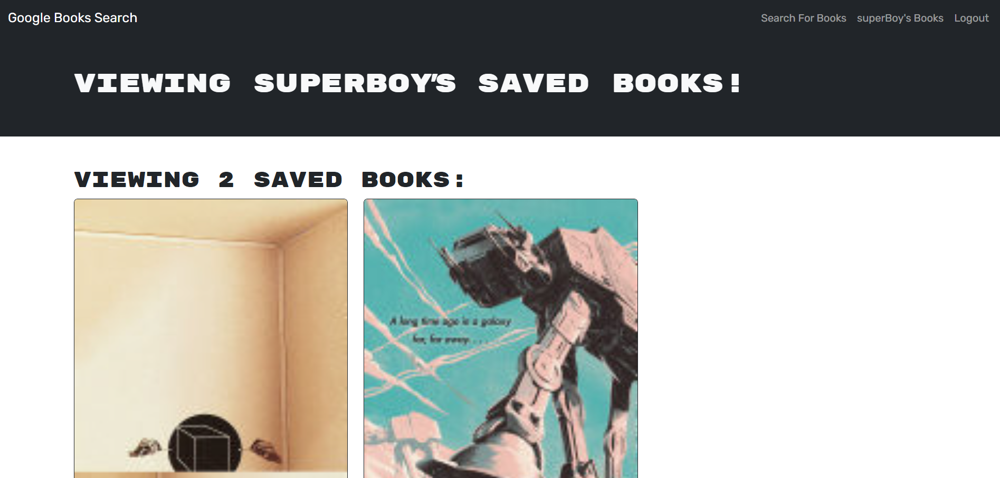

# Challenge-18 (Book Collection)

## Introduction

[](https://opensource.org/licenses/MIT)
[](https://github.com/ellerbrock/typescript-badges/)

This website lets users search and save books to a collection that can be viewed at any time! To visit our site online click <a href='https://challenge-18.onrender.com'>this</a> link!

## Table of Contents

- [Required-Technologies](#required-technologies)
- [Installation](#installation)
- [Usage](#usage)
- [Code Snippet](#code-snippet)
- [Screenshots](#screenshots)
- [Features](#features)
- [Future-Features](#future-features)
- [License](#license)
- [Technologies](#technologies-used)
- [Credits](#credits)
- [Contact Me](#contact-me)

## Required Technologies

This project requires node.js and its included node package manager.\
You can go to <a href="https://nodejs.org/en/download/package-manager">this</a> website to download node.js and npm. Just follow node's included download instructions!

MongoDB is also required to use this Project. You can follow <a href="https://www.mongodb.com/">this</a> to go to mongoDB's main site. Just follow their instructions on how to install mongoDB onto your system.

## Installation

Once the files are downloaded onto your machine open the project folder and run the terminal in the root directory.
To install the necessary dependencies run the "npm i" and the "npm run install" command to install the required files.

To start the application just use "npm run start" to run the server. A list of commands is provided in the "package.json" file for additional commands.

## Usage

Once the site has been started you will be greeted with the search home page. On this page you can look up books by name and by using Googles book search api we can look up books in their database. Just click on the input bar near the top of the page and type in any book title. Once a title has been typed you can hit the enter key or click the submit button to submit your search.
After the submit button has been pressed the page will load in books realated to your search. A book can be saved by clicking the save button under each books card.

However if you clicked on the save button without being signed in you may run into issues pulling up your saved book. To create or sign into an account click the create/sign in button on the top of the page located on the navbar.
Once clicked on a model will appear with input boxes for adding information to sign in or sign up. If you wish to sign into an account then simply click the sign in link on the modal and input your email and password to their respective boxes and hit the submit button to confirm your information.
If you wish to create an account with us, simply click the create an account link in the modal and input your email, username, and password into the input boxes and hit the submit button to confirm your information.

After an account has been signed into or created you will be signed into your account and redirected to the home page (book search). To confirm that you have signed into your account you may look at the nav bar to see if new links have appeared.
On the nav bar should now be options to go to your books and to logout of your account. Now that your signed into your account try searching a book and saving it. Once saved click on the "username books" link on the navbar to be redircted to your book collection.
Inside this collection are all the books that you have saved to your account. If you wish to remove a book simply go to the bottom of their card and hit the remove book button in red. The book will then be removed from your account and page.

## Code Snippet

The bulk of this assignment was mainly dedicated to switching the already working site from a RESTfull API to a MERN api. That is to say this site went from using REST API conventions to now using graphQL to handle it's end to end operations.
This piece of code is contained within our resolvers.ts file as apart of our server. It is a mutation that allows users to save books to their account.

Within our parameters we take the input (Which is assigned a type of AddBookArgs) and the context. The context contains our users Id and by using this we can update a users saved books with the input recieved from the client. This input should come in the shape of a book which contains its description, author(s), title, ect.

```
saveBook: async(_parent: any, {input}: AddBookArgs, context: any) => {
            console.log("Received input:", input);
            if(context.user){
                const updatedUser = await User.findOneAndUpdate(
                    { _id: context.user._id },
                    { $addToSet: { savedBooks: input } },
                    {new: true},
                );

                return updatedUser;
            }
            throw AuthenticationError;
            ('You need to be logged in to use this feature!');
        },
```

## Screenshots

#### This is the home page of the book search page.



#### This is the login model.



#### This is the create a user model.



#### This is adding a book to the signed in user.



#### This is the saved books page for our user.



## Features

Features include:

- Add accounts
- Log into accounts
- Search books with a title
- Add books to an account
- View books saved to an account

## Future Features

Personally to me their is not much i can say should be added to this assignment. It does what it needs to do. In the future it may be maintained but as it is right now it is feature complete.

## License

Licensed under the MIT license.

## Technologies Used

<ul>
<li>The mongoose docs <a href='https://mongoosejs.com/docs/'>here</a> (general mongoose help)</li>
<li>Stack Overflow (For specific mongoose issues and ideas)</li>
<li>Node.js (for installing packages as well as building and running code).</li>
<li>Visual Studio Code (for writing code).</li>
<li>Mozila Web Docs and W3 Schools (for getting help with TypeScript).</li>
</ul>

## Credits

<ul>
<li>Joshua Pruitt (me)</li>
<li>Coding bootcamp staff (for their help with Coding)</li>
</ul>

## Contact Me

<ul>
<li>My email: joshuapruitt6484@gmail.com</li>
<li><a href=https://github.com/JoshuaPruitt>My GitHub</a></li>
<li><a href=https://www.linkedin.com/in/joshua-pruitt-1a494a311>My LinkedIn</a></li>
</ul>
